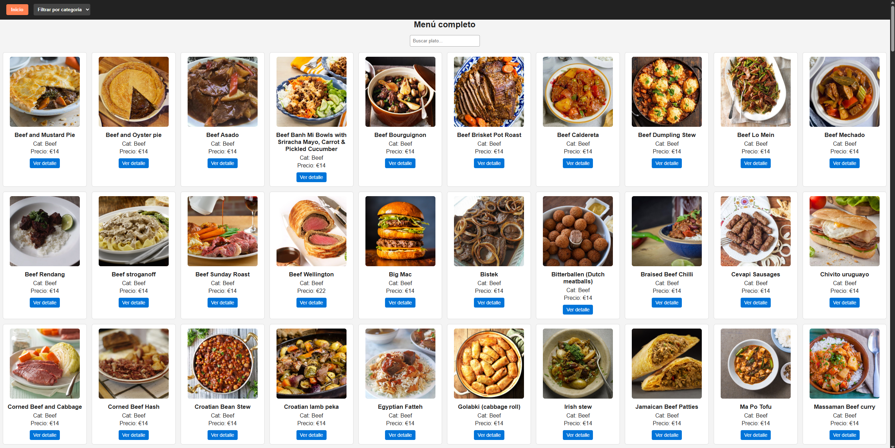

## Restaurant-Menu

This is a restaurant web application built with **React**. It displays a **full menu of dishes** using data from the free API [TheMealDB](https://www.themealdb.com).

Features:
- View all available dishes.
- Search dishes by name.
- Filter dishes by category.
- Check dish details including image, category, and fixed price.

The goal of this project is to **practice functional components, props, useEffect, and fetch**, while applying **usability principles** such as visual hierarchy and loading feedback.

---

## Installation and Usage

1. Clone the repository:
```bash
git clone <https://github.com/ElMasue/restaurant-menu>
```
2. Install dependencies:
```bash
npm install
```
3. Start the development server:
```bash
npm run dev
```
4. Open the application in your browser:
```bash
http://localhost:5173
```

---

## Technologies Used

- React 18 (Vite)
- TypeScript
- Native fetch API
- Simple CSS for styling

---

## Features

- Display a list of dishes with image, name, category, and fixed price.
- Search dishes by name.
- Filter dishes by category.
- View detailed information for each dish.
- Show loading feedback while data is being fetched.
- Display clear messages if an error occurs or if no dishes are found.

---

## Screenshot



---

## Author

- Samuel Corado Cañete
- GitHub: [ElMasue](https://github.com/ElMasue)